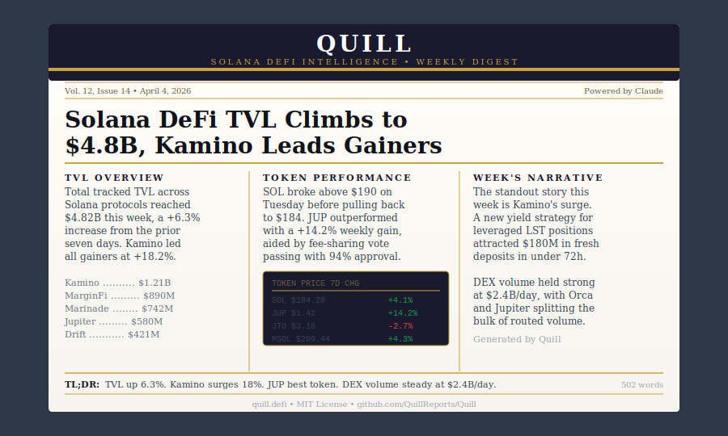
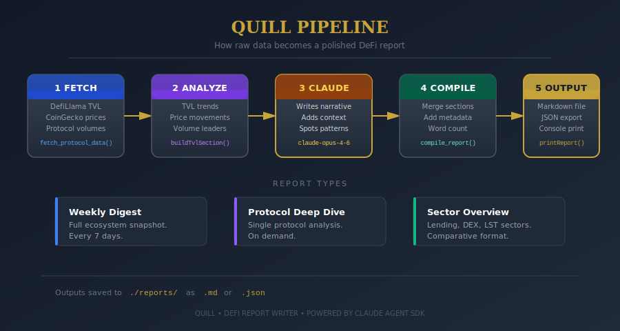

<div align="center">

# Quill

**AI-powered DeFi report writer for Solana.**
Turns raw on-chain data into polished weekly digests, protocol deep dives, and sector overviews. Outputs markdown or JSON.

[](https://github.com/QuillReports/Quill/actions)

[](https://docs.anthropic.com/en/docs/agents-and-tools/claude-agent-sdk)

</div>

---

Good data is everywhere. Good writing about that data is rare. `Quill` pulls TVL from DefiLlama, prices from CoinGecko, and passes everything to Claude — which writes a proper report with narrative, context, and a genuine point of view. Not a dashboard. Not a spreadsheet. A report you'd actually read.

```
FETCH → ANALYZE → WRITE → COMPILE → PUBLISH
```

---

## Sample Report



---

## Report Pipeline



---

## Report Types

| Type | Description | Cadence |
|------|-------------|---------|
| **weekly_digest** | Full Solana DeFi snapshot — TVL, prices, volume, narrative | Weekly |
| **protocol_deep_dive** | Single protocol analysis with historical context | On demand |
| **sector_overview** | Cross-protocol comparison by sector (lending, DEX, LST) | On demand |

---

## Quick Start

```bash
git clone https://github.com/QuillReports/Quill
cd Quill && bun install
cp .env.example .env
bun run dev
```

Set `REPORT_TYPE=protocol_deep_dive` or `REPORT_TYPE=sector_overview` for other formats.

---

## License

MIT

---

*data without narrative is noise.*
